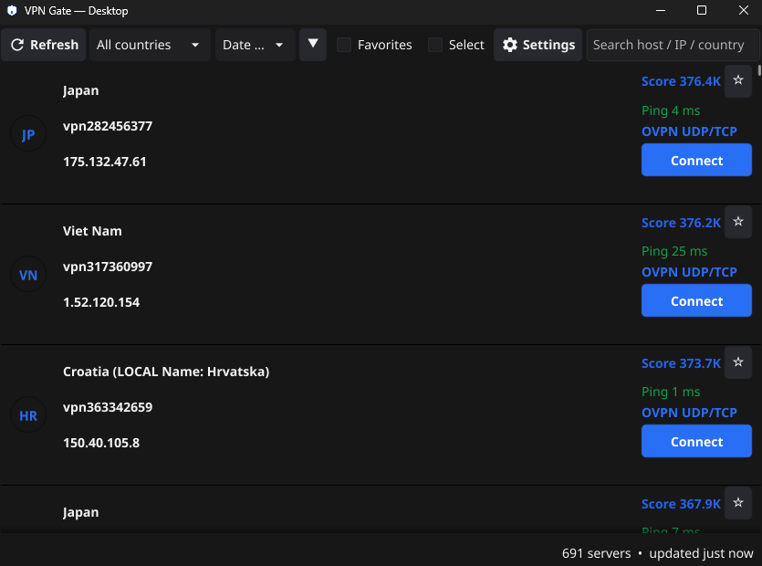

# VpnGate-Desktop

A cross-platform (Windows / macOS / Linux) desktop client for browsing and exporting the public **VPN Gate** server list. Inspired by [VpnGate-Android](https://github.com/hjfisher/VpnGate-Android).

## Features

- **Live server list** – Pulls the latest servers directly from vpngate.net (multiple endpoints, automatic fallback; optional mirror via r.jina.ai).
- **Offline cache** – Every fetch is accumulated and deduplicated by IP, saved to disk (`~/.config/vpngate/servers.json` or platform equivalent). Works completely offline after first successful fetch.
- **Search & sort** – Filter by keyword; sort by Score, Ping, Speed, or Sessions (ascending/descending).
- **Filter by country** – Dropdown to show only servers from a chosen country.
- **Protocol badge** – Each server shows its OpenVPN transport: `OVPN UDP`, `OVPN TCP`, or `OVPN UDP/TCP`.
- **Ping measurement** – Live TCP connect latency (port 443) per server, with color-coded results.
- **Favorites** – Star servers and optionally show only favorites.
- **Export `.ovpn` files** – Write configs to a folder of your choice (default `~/Downloads/VPNGate`), then open the folder or hand a single file to your OS default OpenVPN client.
- **Selection mode** – Multi-select servers to delete in bulk or export several configs at once.
- **Manage saved data** – Delete an individual server from its detail view, or clear the entire cache from Settings.
- **Settings** – Theme (System / Light / Dark), default sort order, auto-refresh interval (off / 10 / 30 / 60 min), mirror endpoint toggle, export folder picker.
- **Connect** – One click saves the `.ovpn` file and launches it with the default application (OpenVPN Connect, OpenVPN for Android, Tunnelblick, etc.).

## Screenshots

<p align="center">
  
</p>
<br>

## Requirements

- **Go 1.21+** (tested with 1.27)
- A C compiler for the native UI driver (Fyne uses `glfw` which requires CGO):
  - **Windows**: MinGW-w64 (`gcc`) — install via `winget install GnuWin64.GCC` or download from [winlibs.com](https://winlibs.com/).
  - **macOS**: Xcode Command Line Tools (`xcode-select --install`).
  - **Linux**: `build-essential` / `gcc` + OpenGL development headers (`libgl1-mesa-dev`, `libglfw3-dev`, etc.).

## Building

```bash
git clone <your-fork-or-path>
cd VpnGate-Desktop
go mod download
go build -o vpngate-desktop .
```

The binary `vpngate-desktop` (or `vpngate-desktop.exe` on Windows) is self-contained — just copy it wherever you like.

### Cross-compilation (from Linux/macOS to Windows)

```bash
# Requires a Windows cross-compiler (e.g. x86_64-w64-mingw32-gcc)
CGO_ENABLED=1 GOOS=windows GOARCH=amd64 CC=x86_64-w64-mingw32-gcc \
  go build -o vpngate-desktop.exe .
```

## Running

```bash
./vpngate-desktop
```

On first launch it will:
1. Load any previously cached servers (instant UI).
2. Start a background fetch from vpngate.net.
3. Show a spinner while refreshing; if the fetch fails and no cache exists, a notification appears.

## Configuration

All persistent data lives in the platform-standard config directory:

| Platform        | Path                                          |
|-----------------|-----------------------------------------------|
| Windows         | `%APPDATA%\vpngate\`                          |
| macOS           | `~/Library/Application Support/vpngate/`      |
| Linux / others  | `~/.config/vpngate/`                          |

Files:
- `servers.json` – accumulated server list (JSON array)
- `settings.json` – user preferences (theme, sort, auto-refresh, mirror, export folder, favorites)

## Usage

| Action                  | How                                       |
|-------------------------|-------------------------------------------|
| Refresh server list     | Click **Refresh** in the toolbar          |
| Search                  | Type in the search box (host, IP, country)|
| Filter by country       | Choose from the **Country** dropdown      |
| Change sort             | Pick **Score / Ping / Speed / Sessions**  |
| Toggle favorites only   | Check **Favorites**                       |
| View server details     | Click any row                             |
| Measure ping            | In detail view, click **Check connection**|
| Add/remove favorite     | Click the ★/☆ button on a row or in detail|
| Export selected         | Enable **Select**, pick rows, **Export .ovpn** |
| Export one server       | In detail view, click **Export .ovpn**    |
| Connect (launch client) | Click **Connect** on a row or in detail   |
| Copy config to clipboard| In detail view, click **Copy config**     |
| Delete server           | In detail view, click **Delete server**   |
| Clear all cached data   | Settings → **Clear saved servers**        |

## Project Structure

```
VpnGate-Desktop/
├── main.go                    # Entry point
├── go.mod / go.sum
└── internal/
    ├── data/                  # Pure-Go data layer
    │   ├── server.go          # VpnServer model + helpers
    │   ├── api.go             # Multi-endpoint HTTP fetch with mirror fallback
    │   ├── parser.go          # CSV → []VpnServer
    │   ├── store.go           # JSON persistence (deduplicated by IP)
    │   └── settings.go        # AppSettings + JSON store
    ├── net/                   # Network utilities
    │   ├── ping.go            # TCP connect latency
    │   ├── exporter.go        # Write .ovpn files to disk
    │   └── launcher.go        # Open file/folder with OS default app
    ├── controller/            # App state & background work (ViewModel analogue)
    │   └── controller.go      # Filtering, sorting, selection, auto-refresh, etc.
    └── ui/                    # Fyne UI
        ├── list.go            # Main window: toolbar + server list
        ├── detail.go          # Server detail window
        ├── settings.go        # Settings window
        ├── card.go            # Server row widget (tappable card)
        ├── actions.go         # Shared actions (connect, copy, export)
        └── format.go          # Score/ping formatting + colors
```

## License

For personal and educational use. Based on the public VPN Gate API — respect their terms of service.

## Acknowledgements

- [VPN Gate](https://www.vpngate.net/) for the free public VPN relay service.
- [VpnGate-Android](https://github.com/hjfisher/VpnGate-Android) for the original design and feature set.
- [Fyne](https://fyne.io/) for the excellent cross-platform Go GUI toolkit.